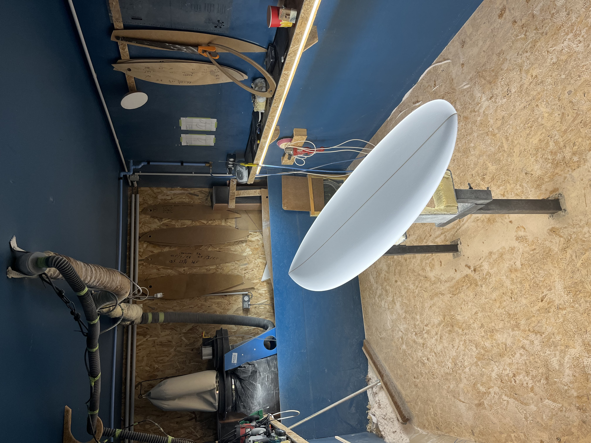
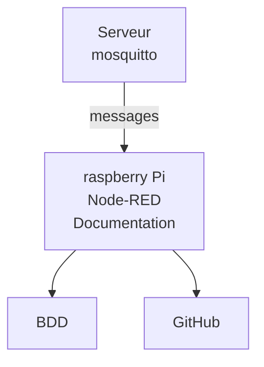
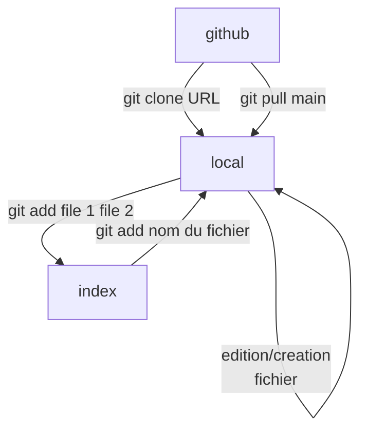

# test-univ-tours

Projet test

Ce que le projet va permettre :

* récupérer des messages 
* les stocker en BDD
* les afficher 
* utiliser Node-RED

```mermaid
flowchart TD
    mosquitto[Serveur<br>mosquitto] --> |messages| RPi[raspberry Pi<br>Node-RED<br> Documentation]
    RPi --> BDD
    RPi --> GitHub
```

```mermaid
flowchart TD
    github --> |git clone URL| local
    github --> |git pull main| local
    local -->| git add file 1 file 2 | index
    index --> | git add nom du fichier| local
    local --> |edition/creation<br>fichier| local
```